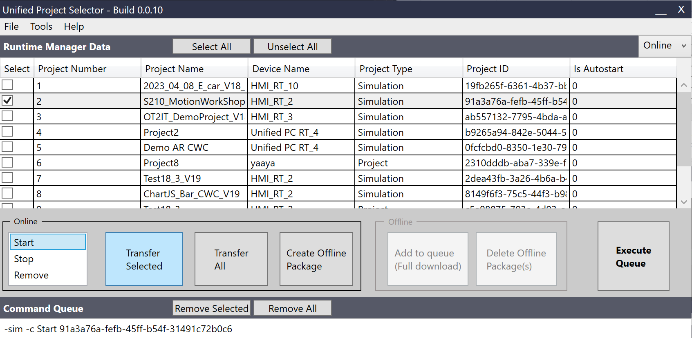
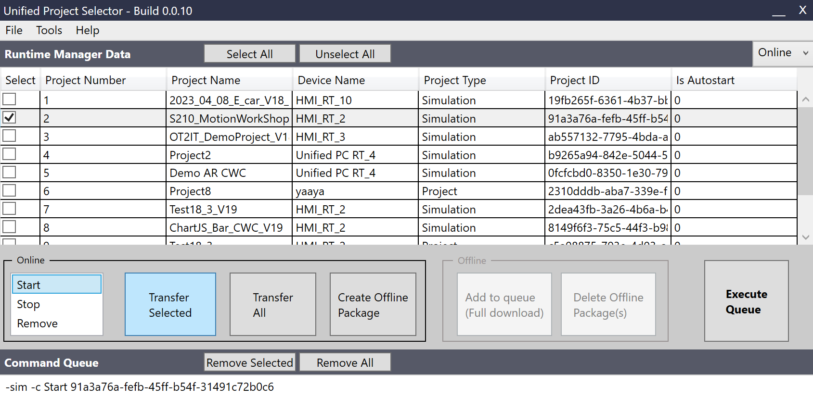
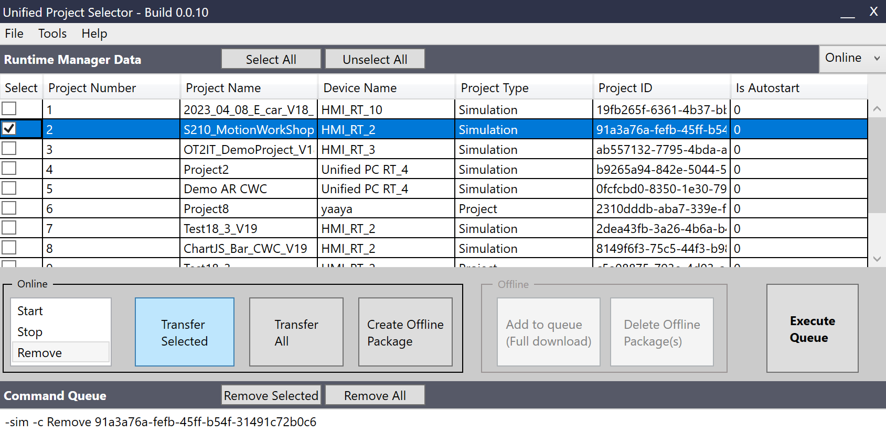
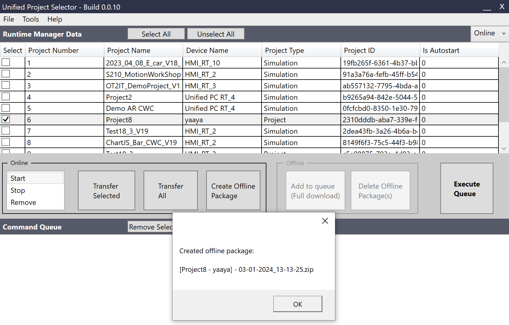
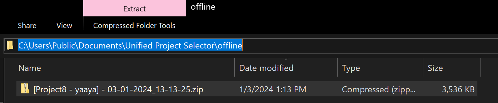
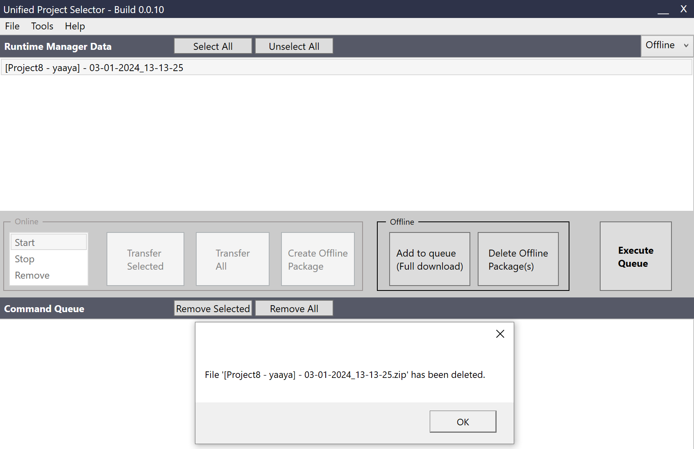
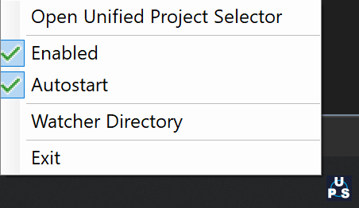

Unified Project Selector - V0.0.10
========================
# Unified Project Selector

## Scope of the program
This program intend to enhance the capability of the `Simatic Runtime Manager` software. The UPC (Unified Project Selector) interacts with the API of the Runtime Manager, to do batch command or "queuing" on multiple projects available in the Runtime Manager of WinCC Unified. None of the interaction with **secure project** (password protected) will work for now. For extended knowledge about the CLI of the Simatic Runtime Manager, please refer to the WinCC Unified Engineering manual, this might be helpful for troubleshooting purpose.

This program as been mainly tested with V18 update 2. It works with other versions, but had not been tested. The config file should be adjusted to the version used.

Some functionalities available with UPS V0.0.10:

| Functionalities          | Description                                                        |
|---------------------|--------------------------------------------------------------------|
| Start       | Send the start command of an already available project |
| Stop    | Send the stop command of an already running project      |
| Remove    | Send the remove command of a selected project in the list  |
| Create offline package   | Creates an offline package (.zip) of selected a `project`, to be loaded on another station|
| Full download an offline package    | Looks into available offline package and trigger a full download (UMC data included) command with it to the Runtime Manager  |
| Delete offline package    | Deletes the file (.zip) on the system  |

### Start
Here is an example of the command sent to the Simatic Runtime Manager via it's CLI API:

`-s -c start 96FE68D0-5337-4072-A96C-F7C1D7525CAF`

It will add `-sim` if it's found to be a `type` simulation. 

### Stop
Here is an example of the command sent to the Simatic Runtime Manager via it's CLI API:

`-s -c stop 96FE68D0-5337-4072-A96C-F7C1D7525CAF`

It will add `-sim` if it's found to be a `type` simulation. 

### Remove
Here is an example of the command sent to the Simatic Runtime Manager via it's CLI API:

`-s -c remove 96FE68D0-5337-4072-A96C-F7C1D7525CAF`

It will add `-sim` if it's found to be a `type` simulation. 

### Create offline package
It doesn't use the CLI of the Simatic Runtime Manager. This functionality is currently limited to some features listed here:

|Functionalities|Comments|
|---|---|
| Tag Persistence  | Currently not supported. It will recreate the DB according to your settings in Tia Portal `Runtime Settings > Storage system` and start a new archive. Make a proper backup of the DB to be able to restore it. |
| Tag Logging  | Currently not supported. It will recreate the DB according to your settings in Tia Portal `Runtime Settings > Storage system` and start a new archive. Make a proper backup of the DB to be able to restore it. |
| Alarm Logging  | Currently not supported. It will recreate the DB according to your settings in Tia Portal `Runtime Settings > Storage system` and start a new archive. Make a proper backup of the DB to be able to restore it. |
| Parameter Control (PaCo)  | Currently it's not supported. You must backup the content of the directory `C:\ProgramData\SCADAProjects\<project>\PACODB` and place it back again after the download of the offline package. |
| Faceplates  | Supported |
| Custom Web Controls (CWC)  | Supported |
| Scheduled Tasks  | Supported |
| UMC Data  | Limited support.   If the file `UMCData.json` exist in `C:\ProgramData\SCADAProjects\project>\currentConfiguration`, it will load the user management. If not, the last available configuration will be used (same as if you download withouth unchecking the box "keep user administration data in runtime).  |

***Note**: Projects with `type` *Simulation* are not supported. 

This function will create a .zip "offline package" into the directory: `C:\Users\Public\Documents\Unified Project Selector\offline`

### Full download an offline package
Here is an example of the command sent to the Simatic Runtime Manager via it's CLI API:

`-s -c fulldownload "C:\Users\Public\Documents\Unified Project Selector\offline\+OfflinePackageName"`

### Delete offline package
It doesn't use the CLI of the Simatic Runtime Manager. This functionality will just delete the .zip (offline package) from the directory `C:\Users\Public\Documents\Unified Project Selector\offline`

## Menu items

| Functionalities          | Description                                                        |
|---------------------|--------------------------------------------------------------------|
| File > Load Offline package  | Currently not used |
| File > Exit  | Used to "Exit" the program |
| Tools > Reload Data   | Re-sync the UPS data with the Simatic Runtime Manager data and will re-sync the available offline packages   |
| Tools > Watcher Service    | Starts the Watcher Service (UPS-WS), for more information see the **Unified Project Selector - Watcher Service** section  |
| Tools > Settings   | Opens the `C:\Users\Public\Documents\Unified Project Selector\settings\ups.cfg` file with your text editor|
| Help > About    | Opens the Github repository url in your internet browser  |
| Dropdown Online/Offline    | Switches the main panel from Online (Runtime Manager proejcts) to Offline packages view  |

### Tips & Tricks
You can doubleclick the header of the program where it say: *Unified Project Selector - Build *.*.*, it will open your file explorer to the `C:\Users\Public\Documents\Unified Project Selector\` directory, for easy access to the config files, offline packages, etc.

# Unified Project Selector - Watcher Service

## Scope of the program
This service program intend to enhance the capability of the `Simatic Runtime Manager` software. The UPS-WS (Unified Project Selector - Watcher Service) listen to a specific folder, so-called the **Watcher Directory** and if the UPS-WS is set to "Enabled", will download the Offline Package (.zip) directly to the Runtime Manager. Also, if the Autostart option is checked, it will attempt to start the project after being downloaded. None of the interaction with **secure project** (password protected) will work for now. 

The service program runs in the system tray, with the UPS icon, you need to right-click on it to see the menu.

Some functionalities available with UPS-WS V0.0.10:

| Functionalities          | Description                                                        |
|---------------------|--------------------------------------------------------------------|
| Open Unified Project Selector       | Will open UPS GUI (if installed on the system) |
| Enabled    | Listen to the Watcher Directory or not|
| Autostart    | Only available if UPS-WS is enabled, will attempt to start the downloaded project  |
| Watcher Directory  | This is to change the folder that UPS-WS looks into. Default: `C:\Users\Public\Documents\Unified Project Selector\watcher` |
| Exit    | Close the application process  |

### Tips & Tricks
There's also a config file for the UPS-WS, located at: `C:\Users\Public\Documents\Unified Project Selector\settings\watcher.cfg`. It contains the current settings for **Enabled** and **Autostart** as well as the folder path of the **Watcher Directory**.

# Disclaimer:

>  The examples are non-committal and do not lay any claim to completeness with regard to configuration and equipment as well as any eventualities. The examples do not represent any custom-designed solutions but shall offer only support at typical tasks. You are accountable for the proper mode of the described products yourself.
> 
>  These examples do not discharge you from the obligation to safe dealing for application, installation, business and maintenance. By use of these examples, you appreciate that Siemens cannot be made liable for possible damages beyond the provisions regarding described above. We reserve us the right to carry out changes at these examples without announcement at any time. The contents of the other documentation have priority at deviations between the suggestions in these examples and other Siemens publications, such as catalogues 